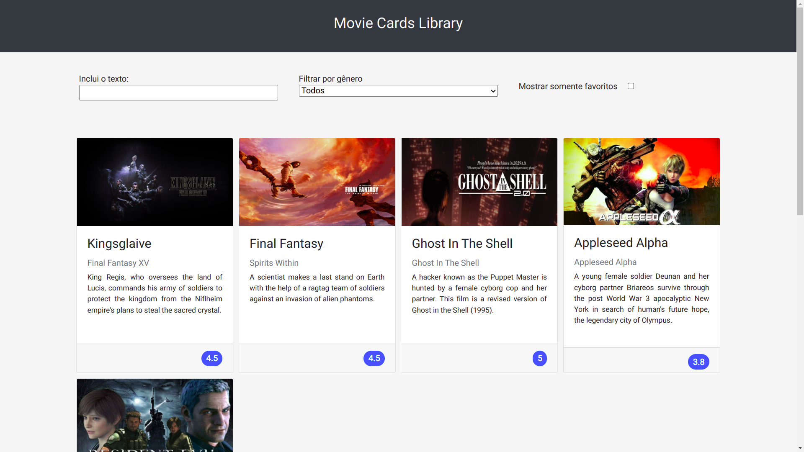

# Contexto 

Este foi um dos primeiros projetos que fiz utilizando React, e nele pude reforçar conhecimentos a cerca de componentes e suas propriedades, como: estado, props, sintaxe JSX e captura de eventos em React.



## Instalando o projeto

1. Clone o repositório:

```
git clone git@github.com:riquelmebandeira/projeto-movie-cards-library.git
```

2. Entre na pasta do repositório clonado:

```
cd projeto-movie-cards-library
```

3. Instale as dependências com o comando:

```
npm install
```

## Executando a aplicação

  ```
  npm start
  ```